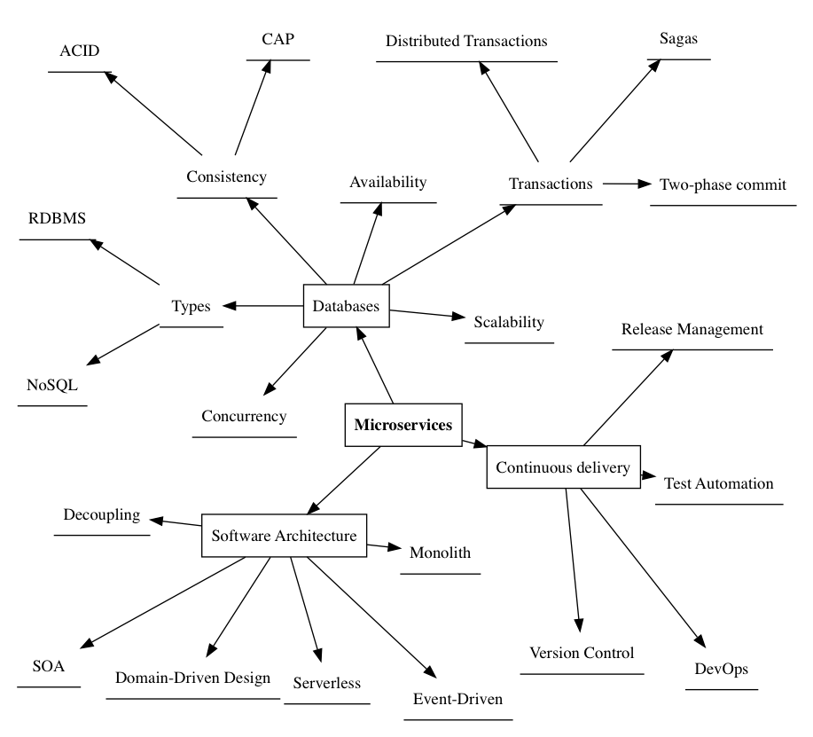

# Writing & Language

> Everything You Always Wanted to Know About Writing 
> (but were afraid to ask)

[Woody Allen](https://www.youtube.com/watch?v=sj0YAuOiLBM)

"So kurz wie möglich, so ausführlich wie nötig."
As brief as possible - as detailed as needed.
That's one of the German quotes you may find here
as my attempt to support someone (or you) in writing
meaningful documents. Intent is to get you good grades
or whatever other positive response from your "sponsor".

A short, loose collection of hints on how to write.

## Introduction - From homeworks to academic writing

I put this document together for a friend who asked me
to help him write a 6-page article for school. I am
no educator but had to write a 100-page document myself
once and did not totally fail. So YMMV meaning your milage
may vary. Use my hints at your own risk.

I refuse ghostwriting but love to help, if I can.
Wish Dave the best.

If you're going through this adventure with me for the
first time, you'll need 6 sheets of paper. Yes.
I just decided 6 is good. I name them #S1 to #S6.
Maybe we can use 4-6 for airplanes in the end.

And you also need a pencil for you.
And one for your buddy, should you brainstorm together.
That's the point. Brainstorming as team is fine.
But YOU MUST WRITE THE FINAL TEXT. Imagine I, as German
would write for a Refugee in Switzerland. Nobody would
be helped. (I don't - just to let you see: Cheaters get caught).

## The task

It must be clear at this stage what kind (or "class") of document you are
supposed to produce. Here are some common german examples ..

| Name           | Where           | Contents                | Size |
|----------------|-----------------|-------------------------|------|
| Aufsatz        | Primary school  | Any freeform text work  | 1~5p |
| Erörterung     | Secondary school| Comments on some topic  | 1~5p | 
| Interpretation | Sec/Highschool  | Text understanding test | 1~5p |
| VA (Zurich)    | Lehre Lagerist etc | Free choice, choose well | 6p |
| Thesis Diplomarbeit Masterarbeit | Institutes of technology, Universities | Same as VA | ~100p |
| Dissertation   | University      | To gain Dr.             | Same as VA | 100+p|

Each document type has some STANDARD outline and contents the
reader WILL expect. Keep both in mind till the end to win.

## Getting started

If you haven't done SOME writing before, then this is the hardest part.
Don't worry, it's easy. Watch the A-Team. A good plan is what matters.
And you, verifying the plan DAILY to avoid surprises and meet the DEADLINE.
The deadline is an ugly word, in German: Abgabetermin - try: 
due date (Fälligkeitsdatum, literally).

Before typing down (or even typesetting) the document, we prepare the
tools needed to get the final document written easily.

REGARDLESS OF DOCUMENT TYPE we need at least these three things:

1. A Mindmap. A mindmap is used to explore your document topic using
   single words describing crucial / relevant corners you will mention,
   i.e. travel along while completing it. It's similar to a TagCloud
   found on the web - The tagcloud gives the words weight using size -
   That means words typeset in a larger font are (thought to be) more 
   relevant for the document itself and/or the reader (!).
   See my example below, which CENTERED around the MicroServices (IT) topic.
   It's based on this [dissertation relevance tree](https://www.nottingham.ac.uk/studentservices/documents/dissertation-relevancetree.pdf), found at University of Nottingham.
   If you don't have to submit it - do it by hand. If you have to submit,
   you may want to use [GraphViz](https://graphviz.org/), which can be
   used to draw all kind of Graphs (think #DAG #Airflow or #TerraForm).
   The "dotty" source code for this example can be found [here](https://github.com/schnoddelbotz/writing/tree/main/examples/relevance-tree_map-mindmap.dot).
   

2. An Outline. The German Stichwort-Liste, the predecessor of the table of contents.
   Nothing more. Inhaltsverzeichnis draft. Overview of document structure and contents. 
   Brief. There should always be room for quick notes (#Brainstorming).

3. A schedule. Zeitplan. Time. Planning. 
   Two-fold. 
   FIRST, for each point of the outline, plan time required, compute total if you wish.
   That means break down the work into CLEARLY IDENTIFYABLE parts (so you can EASILY measure success),
   and stick them into your calendar. More later (Online services, git...)
   SECOND back to real life. You have a job? A life? Or a family? Or even both?
   Nice. They will all break your plan. Be realistic.
   PLAN to submit the paper 20% BEFORE deadline. Worst that can happen to you:
   You're done too early and have zero motivation to improve further. Then submit.

4. A log book. A diary. Of course I did not mention beforehand,
   because it's included in our document (Appendix A) - lame excuse. Yes.
   DAILY exercise. DO SOMETHING. And if it's only writing the
   log entry: Today I failed to do anything.
   It will become harder to write every day. Just be honest to yourself.
   FOCUS your GOAL. Avoid distractions. That's a free
   Wintergatan lesson on learning and dopamin and DISTRACTIONS like
   SocialMedia. Turn them OFF. You have to work, dude!
   Only if you do not trust me - he IS RIGHT!
   Watch:

   <iframe width="560" height="315" src="https://www.youtube.com/embed/eLUDauIxudM" title="YouTube video player" frameborder="0" allow="accelerometer; autoplay; clipboard-write; encrypted-media; gyroscope; picture-in-picture; web-share" allowfullscreen></iframe>

## Software for writing

Oh well. Many books have been written, this is one of them.
If you have a SIMPLE TEXT EDITOR you're feeling comfortable
with, maybe stick with it. The question here is, since decades:
Do you NEED WYSIWYG (What you see is what you get)? That term
was introduced when IT managed to display Adobe Type 1 or even
worse TrueType fonts (today ... replaced. Open.) on SCREEN in
REAL TIME while typing. That was a MILESTONE. Nobody really
needed. Anyhow. Both approaches exist today, and you can choose here:

- CONSOLE Text Editors: vi, vim, emacs, ...
- Graphical Text editors. I know it sounds weird. Thing is,
  back in the day, computer screens only displayed text.
  Then Xerox labs invented the GUI Graphical User Interface,
  things like the Mouse, later sold to Apple etc. X11.
  MIT. Well. You know Microsoft Windows? Before, there was MS-DOS.
  Also text mode (80x25 characters, default).
  TEXTMODE means: The OS tells the GRAPHICS CARD:
  Display TEXT: Hello.
  Done. Graphics mode (same monitor connected, yay!) means that
  the monitor has some resolution, e.g. SVGA 1024x768 pixels.
  Now the computer must compute the OUTLINE of some FONT,
  RENDER it (apply AntiAliasing etc.) and tell the Graphics card:
  Display this BITMAP at location X,Y on screen.
  And the bitmap is, per pixel on screen, a set of RED GREEN and BLUE 
  values, yielding ONE color dot per combination.
  Sorry. This does not belong in here. Must review.
- So graphical TEXT EDITORS: SublimeText, NotePad, NotePad++, TextMate, TextWrangler, BBEdit, nedit (Nirvana Editor, OLD), ...
- Graphical "document editors": Libre Office, Microsoft Word, ...

What I called document editors above are the WYSIWYG tools as of today.
Using them is NOT wrong, especially if you already KNOW them.

If you start from scratch, there are several reasons to go for pure text editors:
1. Revisioning. The graphical document editors all produce binary file formats, 
   which are plain shit to put under version control. Version control tools
   like GIT do not only provide a life long change history of your documents,
   but also serve as constant BACKUP. You CAN put binary files on git,
   but it simply makes no sense. Ask someone.
2. Focus. You are not paid for designing a document. Typesetting is an art.
   VERY VERY few people study typography or even bother about it. Now, with
   type setting tools like LaTeX, YOU do not need to bother - cool, eh?
   The idea is that THE TEXT MATTERS FOR YOU. Do NOT WASTE TIME FORMATTING.
   That's the TASK of a typesetter.

Ja, that's it. So:

EITHER Text + Editor + Git + Latex OR some Graphical document editor, like MS-Word.

To give the Latex approach a quick try, visit OverLeaf - Latex environment in the browser.

Google "Latex download mac" to find MacTex for MacOS etc. I'll add links one day, maybe.

## From Outline to paragraphs, sections, chapters etc.

LaTeX offers various key elements to structure a document, DEPENDING on document type/class defined.

You should have some template document from your school,
requesting certain structure. So if using LaTeX for the task,
we should now go and figure out a matching document type
for our purpose.

See [texblog.org LaTeX documentclass options illustrated](https://texblog.org/2013/02/13/latex-documentclass-options-illustrated/)

## Impressive words

You shall impress your reader. Simple, use impressive terms.
This is often re-discussed: Should you unmask yourself by
using simple words or act like Shakespeare so nobody gets it
and you a good grade? For sure, avoid Schachtelsätze. Literally
box sentences - meaning, miles long and lots of commas.
Readers can't follow. We say prägnant in German, sounds like
pregnant but simply means succinct, brief - all we need.

Take this section with a grain of salt. I'm doing it in German
here and only for some areas I thought I'd have some lame ideas.

### Impressive German words for Refugees
- unmenschlich erbärmlich erniedrigend menschenverachtend ...
- schmerzvoll belastend vernichtet zerstört ...
- Belästigung Übergriffe Vergewaltigung Mord ...

### Impressive German words for Lawyers & Judges
- sofort unverzüglich umgehend baldmöglichst bald 2050
- CUMEX Bestechung Korruption ("Lobbyismus") Seilschaften
- Besonderes elektronisches Anwaltspostfack (bEA) [Lachnummer 4 U]
- Gustl Mollath
- Menschenrechte
- Strafgerichtshof
- Unterlassene Hilfeleistung
- Verschleppung von Straftaten
- Fragwürdige Politik-Kooperationen
- ... to be IMPROVED. Hope you got the idea

### Impressive German words for Computer Scientists
- amazing impressive great awesome FANTASTIC excellent
- kilo mega giga tera peta ... scale
- awk cat sed tr perl wc yacc echo printf tar rev tr id w?

## Example(s)

See [examples/va.tex](./examples/) for an LaTeX
example template for a Vertiefungsarbeit. It's work in
progress and no official thing. But once I stop working
on it, feedback/PRs is/are welcome. Thanks!

The example uses the [KomaScript article class](https://ctan.org/pkg/scrartcl?lang=en).
You can ignore that for now or study the [KomaScript homepage](https://komascript.de/).

# Media - images

Image is not image. LaTeX supports both types of basic
image formats:

- Vector graphics (e.g. PS, EPS, SVG, DXF)
- Bitmap graphics (BMP, TGA, TIFF, JPEG)

Note LaTeX does not support all file types. File converters
help you to translate from formats to those your application,
here LaTeX understands. For images, people often use
[ImageMagick](https://imagemagick.org/index.php). For documents,
other tools like [pandoc](https://pandoc.org/) exist too.
A nightmare. No. Just stick to ONE (or two) formats well-supported
(like JPEG and EPS) and you're good to go.

## Scanning

Back in the day, we often SCANNED newspapers or images to use
them within our documents. Those days are over IMHO - your mobile
phone does it equally good IF LIGHT CONDITIONS are good and
you act like the scanner:

1. Set up bright room, indirect sunlight ideally?
2. Put photography or book or ... on a TABLE
3. Now move OVER the book FROM top. Not from the side, no angle.
4. Ensure no glare, minimally adjust position if reflections

To verify success of point 3: Aspect ratio. It must be the same for
the original book like on the image. Crushed or skewed images look
awful.

You may need to adjust #WhiteBalance in your camera or using
some #PostProcessing #ImageEditing tool. To make a yellow/warm
page of paper truly look white, it must be COLD. Warm colors
mean cozy redish. You do not want this in your work.

## Ready, set, go! Gnah?! Writing the first sentence.

So we now have a multi-core CPU running at 3 or more GigaHertz,
gigabytes of free RAM -- now it's our task to [say something](https://www.youtube.com/watch?v=-2U0Ivkn2Ds) useful.

Can't type just yet?

I guess we'll be here tonight as well. Ever heard of a dictaphone?
You don't need it. Open Voice recorder app on your mobile phone.

Now choose one of the topics from YOUR OUTLINE.

Tell me something. I do not bite. If you say something useful,
accidentally, we now have it on tape and you can type it down
at your own pace.

<iframe width="560" height="315" src="https://www.youtube.com/embed/eYdr0r5hEN0" title="YouTube video player" frameborder="0" allow="accelerometer; autoplay; clipboard-write; encrypted-media; gyroscope; picture-in-picture; web-share" allowfullscreen></iframe>

You just heard the sound of an original typewriter, as intially
developed by IBM, International business machines OR SO.
I am not sure. Go ask them. All I can tell is that even doctors
around the year 2000 prefered speaking to voice recorders,
as WRITING is CHALLENGING. It's easier to speak.
Go to a #Schreibbüro if you do not want to learn typing on a keyboard.
My dad was the same, so I gifted him an #IPAD. He made some money
using stocks then, I tell you. I also tell you:

<iframe width="560" height="315" src="https://www.youtube.com/embed/U8Qc_dzQTJ4" title="YouTube video player" frameborder="0" allow="accelerometer; autoplay; clipboard-write; encrypted-media; gyroscope; picture-in-picture; web-share" allowfullscreen></iframe>

Yes, I never did that. There are tools to learn PLACING your
hands CORRECTLY on a keyboard. I started using the two-finger-hawk-search-approach
(the [Adler-Suchsystem](https://de.wikipedia.org/wiki/Adlersuchsystem)), which
I now have to tell [Hamdan](https://twitter.com/HamdanMohammed) about.
I think he loves hawks as well. Save the planet. Visit Dubai for hawks!

# Legal

These tips come without warranty. See room for improvement?
This is OpenSource. Either file a pull request to help making this
document better or go on an ego trip, fork the repo and then
rewrite from scratch. Mentioning me in source would be nice
but I'm no dreamer.

As student, I'd stay away from ghostwriters. Maybe better ask
a friend to do brainstorming with you. Independent. New ideas.
That's allowed. Also keep in mind, most schools DO USE plagiarism
detection tools nowadays. The more retarded ones make a secret
out of the magic, transparent ones like Liverpool University
simply state: Submit via TurnItIn (which is a plagiarism checker).
The more universities participate, the bigger the fundus of
prior art gets. So you will be more and more limited in the
future. Good luck with that! Try reprhasing shit a thousand times.
And keep in mind those plagiarism checkers gain all your knowledge.

ETHICS is the core problem most governments have proven unable
so far to deal with - so don't start talking about IT. Not in
this decade. Go, grab your pencil now. PEACE.
